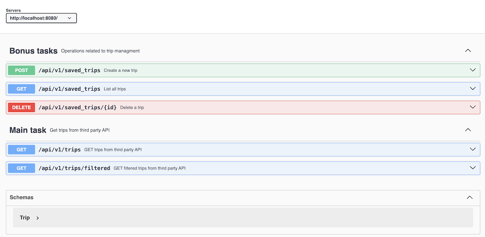
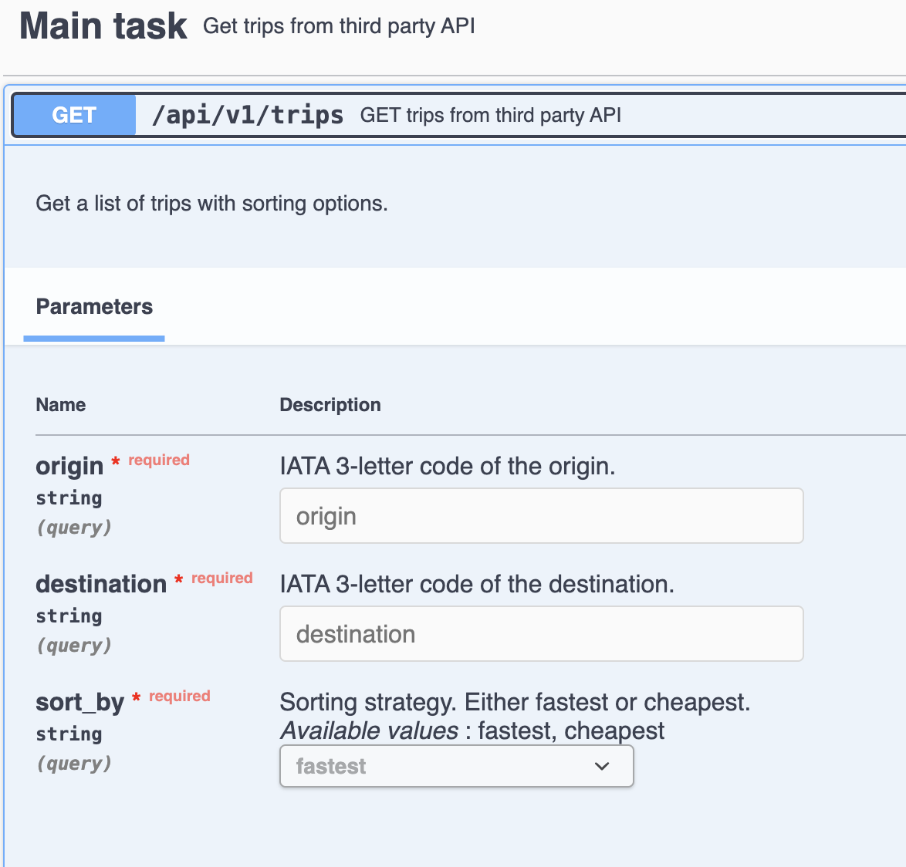
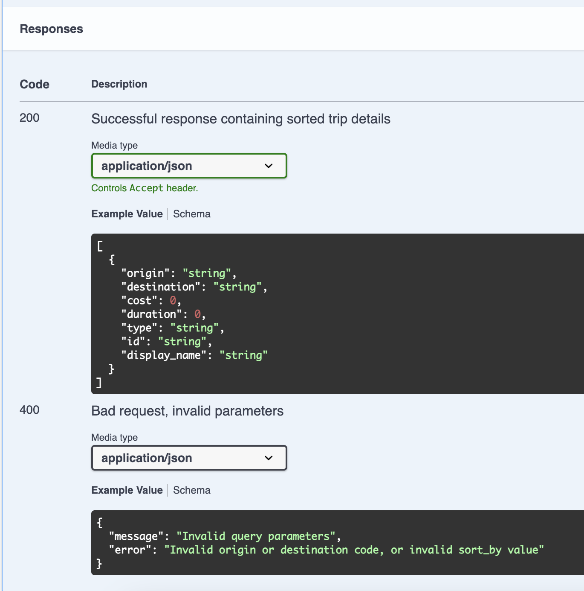

#### Created by : Atabay Heydarli

# Node.js Trip Management API

## Table of Contents

- [Introduction](#introduction)
- [Features](#features)
- [Getting Started](#getting-started)
  - [Prerequisites](#prerequisites)
  - [Installation](#installation)
- [Running the Application](#running-the-application)
  - [Manually](#manually)
  - [Using Docker Compose](#using-docker-compose)
- [API Documentation](#api-documentation)
  - [Accessing Swagger](#accessing-swagger)
  - [API Endpoints](#api-endpoints)
- [Running Tests](#running-tests)
  - [Test Coverage](#test-coverage)
- [Environment Variables](#environment-variables)

## Introduction

This Node.js application provides a simple API for managing trips, including fetching trips from a third-party API with optional filtering and sorting features. The application was developed as part of the recruitment process for the Backend Engineer position at Bizaway.


## Features

- Fetch trips from a third-party API and sort them based on cost and duration.
- Filter trips by origin, destination, price range, and transport type.
- MongoDB for storing trip collections
- Simple functions on Trips, such as Saving, Deleting and Listing.
- Automatically generated API documentation using Swagger/OpenAPI.
- Comprehensive test coverage using Jest and Supertest.

## Getting Started

### Prerequisites

Before you begin, ensure you have the following installed:

- [Node.js](https://nodejs.org/en/download/) (version 14.x or higher)
- [npm](https://www.npmjs.com/get-npm) (comes with Node.js)
- [Docker and Docker-Compose](https://www.docker.com/get-started) (for running with Docker Compose)

### MongoDB Integration

This application uses MongoDB to store and manage saved trips. The MongoDB instance is hosted on MongoDB Atlas, a cloud-based database service.

### Connection

Ensure you have the following environment variables set for MongoDB connection:
- **MONGODB_URI**: The connection string to the MongoDB Atlas cluster.


### Installation

1. Clone the repository:

   Clone by SSH:
    ```bash
    git clone git@github.com:HeydarliAtabay/bizaway_test.git
    ```

    Clone by HTTPS:
    ```bash
    git clone https://github.com/HeydarliAtabay/bizaway_test.git
    ```

    Enter to the folder of application:
    ```bash
    cd bizaway_test
    ```

## Running the Application

### Manually

To run the application manually on your local machine:

1. Set up environment variables. You can do this by creating a `.env` file in the root of the project:

    ```bash
    PORT=port_number
    API_KEY=your-api-key
    API_URL=https://api.thirdparty.com/v1
    MONGODB_URI=mongodb+srv://address_to_mongo_db
    ```
2. Install dependencies which is necessary to the Application:

    ```bash
    npm install
    ```
3. Setup and Build

Before running the application, ensure that your TypeScript code is compiled into JavaScript. This is necessary because Node.js runs JavaScript, not TypeScript.

- **Build the Project:** Compiles TypeScript files into JavaScript.
  
  ```bash
  npm run build
  ```
  This command uses ```npx tsc```  to trigger the TypeScript compiler, which converts the .ts files in your project into .js files inside /dist folder.

3. Start the application:

    ```bash
    npm start
    ```

   The application will be running at `http://localhost:${PORT}`.

   Note: This Port is provided in environment variables (.env)

### Using Docker Compose

To run the application using Docker Compose:

1. Ensure Docker is running on your machine.

    For checking rather you Docker is running or not run command:

    ```bash
    docker info
    ```

2. Set up environment variables in a `.env` file (same as above).

3. Build and start the containers:

    ```bash
    docker-compose up -d --build
    ```

    The application will be running at `http://localhost:${PORT}`.

   Note: This Port is provided in environment variables (.env)
## API Documentation

### Accessing Swagger

Once the application is running, you can access the Swagger UI for API documentation at:

- **Swagger UI:** `http://localhost:{PORT}/api-docs`

### API Endpoints

## 1. Get Trips

### Endpoint
- **URL:** `/api/v1/trips`
- **Method:** `GET`

### Description
Retrieve a list of trips from a third-party API with sorting options based on cost and duration.

### Query Parameters
- **origin** (required): IATA 3-letter code of the origin.
- **destination** (required): IATA 3-letter code of the destination.
- **sort_by** (required): Sorting strategy. Either `fastest` or `cheapest`.

### Responses
- **200 OK**
  - Description: Successful response containing sorted trip details.
  - **Content Example:**
    ```json
    [
      {
        "origin": "MIA",
        "destination": "ATL",
        "cost": 120,
        "duration": 120,
        "type": "flight",
        "id": "1",
        "display_name": "Flight from MIA to ATL"
      }
    ]
    ```
- **400 Bad Request**
  - Description: Invalid query parameters.

- **500 Internal Server Error**
  - Failed to fetch trips from external API.

---

## 2. Get Filtered Trips

### Endpoint
- **URL:** `/api/v1/trips/filtered`
- **Method:** `GET`

### Description
Retrieve a list of trips from a third-party API with optional filtering options, based on price range and transport type.

### Query Parameters
- **origin** (required): IATA 3-letter code of the origin.
- **destination** (required): IATA 3-letter code of the destination.
- **price_range** (optional): Array with two integers representing the minimum and maximum price.
- **transport_type** (optional): Filter by transport type (e.g., `train`, `car`, `flight`).

### Responses
- **200 OK**
  - Description: Successful response containing filtered trip details.
  - **Content Example:**
    ```json
    [
      {
        "origin": "MIA",
        "destination": "ATL",
        "cost": 100,
        "duration": 100,
        "type": "flight",
        "id": "2",
        "display_name": "Economy Flight from MIA to ATL"
      }
    ]
    ```
- **400 Bad Request**
  - Description: Invalid price range or transport type value.
- **500 Internal Server Error**
  - Description: Failed to fetch trips from external API.

---

## 3. Create a New Trip

### Endpoint
- **URL:** `/api/v1/saved_trips`
- **Method:** `POST`

### Description
Create a new trip with details such as origin, destination, cost, duration, and type. Created trip is saved in MongoDB collection.

### Request Body
- **Content-Type:** `application/json`
- **Schema:** `Trip`
  - **Example:**
    ```json
    {
      "origin": "MIA",
      "destination": "ATL",
      "cost": 120,
      "duration": 120,
      "type": "flight"
    }
    ```

### Responses
- **201 Created**
  - Description: Trip created successfully.
- **400 Bad Request**
  - Description: Failed to create trip.

### Usage of this API

- As there is no Frontend of the Application, it is suggested to run ```GET /api/v1/trips``` before calling current API (saving trips), and copy one Json from results, which corresponds to single trip. Delete an ID from the json, and put it as a request body to this API. Example is already shown above
---

## 4. List All Trips

### Endpoint
- **URL:** `/api/v1/saved_trips`
- **Method:** `GET`

### Description
Retrieve a list of all saved trips MongoDB.

### Responses
- **200 OK**
  - Description: A list of trips is returned.
  - **Content Example:**
    ```json
    [
      {
        "id": "1",
        "origin": "MIA",
        "destination": "ATL",
        "cost": 120,
        "duration": 120,
        "type": "flight"
      }
    ]
    ```
- **400 Bad Request**
  - Description: Failed to fetch trips.

---

## 5. Delete a Trip by ID

### Endpoint
- **URL:** `/api/v1/saved_trips/{id}`
- **Method:** `DELETE`

### Description
Delete a trip by its ID from MongoDB.

### Parameters
- **Path Parameter:** `id` (required) - The unique identifier of the trip.

### Responses
- **200 OK**
  - Description: Trip deleted successfully.
- **404 Not Found**
  - Description: Trip not found.
- **400 Bad Request**
  - Description: Failed to delete trip.

---
For detailed request and response schemas, please refer to the [Swagger UI](http://localhost:{PORT}/api-docs).

## Running Tests

This application uses Jest for testing. Tests include validation checks, controllers, services, and middleware.

To run tests:

```bash
npm run test
```
This command will run the test suite and provide results for all defined test cases. This command also will generate a coverage report and store it in the coverage directory. The report will include detailed information on which parts of your code are covered by tests and which are not.

This is the resulting Coverage Report, which were generated by Jest.


## Some screenshots from the application

Here is the visual representation of the API documentation:

<p align="center">
  
</p>


<p align="center">
  
</p>


<p align="center">
  
</p>


